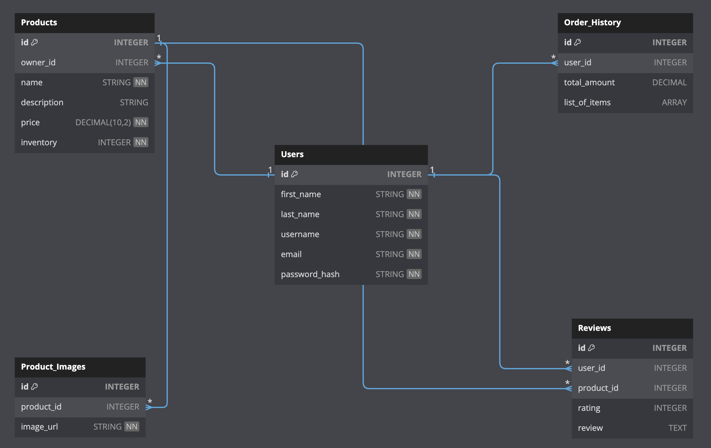

# Beat Boutique Docs

### Link to the site
[Beat Boutique](https://beat-boutique.onrender.com)

# DB -  Schema

 
 
 
 

# Beat Boutique - Features

## Products

### Get all Products

### Users should be able to view all Products.

As a user When I navigate to the "Products" section of the platform, I should see a list of all available products.

As a user each product in the list/grid should display its name, price, and an image thumbnail for easy identification.

As a user by clicking on a product should take me to its detailed page for more information.

- Require Authentication: False
- Request
  - Method: GET
  - URL: /products

### Users should be able to create a Product

As a log in user I want to be able to create a new product listing.

New listing should include name, item, price, image(s) and inventory -how many items are available for sale-

As a user once created, the product should appear in the product catalog for users to view and purchase.

- Require Authentication: True
- Request
  - Method: POST
  - URL: /products

### Users should be able to update their Product(s)

As a user I want to be able to update the details of my existing product listings.

As a user all changes made to the product details should be reflected accurately in the system once the update is confirmed.

- Require Authentication: True
- Require proper authorization: product must belong to the current user
- Request
  - Method: PUT
  - URL: /products

### Users should be able to delete their Product(s)

As a user I want to be able to delete my existing product listings.

As a user before confirming the deletion, the system should display a confirmation dialog to ensure that the user intends to delete the selected product(s)

- Require Authentication: True
- Require proper authorization: product must belong to the current user
- Request
  - Method: DELETE
  - URL: /products

## Reviews

### Users should be able to view all reviews on a Product

As a user I want to be able to view all the reviews associated with a product.

As a user When I navigate to a product detail page, I should see a section dedicated to displaying product reviews.

- Require Authentication: False
- Request
  - Method: GET
  - URL: /products/<product_id>/reviews

### Users should be able to create a review for a Product

As a log in user I want to be able to create a review for a product I have purchased or used.

As a user my review should be displayed in the product's review section along with other reviews.

- Require Authentication: True
- Request
  - Method: POST
  - URL: /products/<product_id>/reviews

### Users should be able to update their review for a Product

As a user I want to be able to update a review I have previously submitted for a product.

As a user I should be able to make changes to any of the reviews I made before.

- Require Authentication: True
- Require proper authorization: product must belong to the current user
- Request
  - Method: PUT
  - URL: /products/<product_id>/reviews

### Users should be able to delete their review from a Product

As a user I want to be able to delete a review I have previously submitted for a product.

As a user my review should be permanently removed from the product's review section.

- Require Authentication: True
- Require proper authorization: product must belong to the current user
- Request
  - Method: DELETE
  - URL: /products/<product_id>/reviews

## Shopping Cart

### Users should be able to view all products added to their cart

As a user I want to be able to view all the products I have added to my cart.

As a user the total price for all items in the cart should be clearly displayed at the bottom of the page.

A "Proceed To Checkout" button should be displayed under the total price 

- Require Authentication: True
- Request
  - Method: GET
  - URL: /cart

### Users should be able to add products to their shopping cart

As a user I want to be able to add products to my shopping cart.

As a user by Clicking on the "Add to Cart" button should add the selected product to my shopping cart.

- Require Authentication: True
- Request
  - Method: POST
  - URL: /cart

### Users should be able to remove products from their shopping cart

As a user I want to be able to remove products from my shopping cart.

As a user upon removal, the selected product should be immediately removed from my cart.

If quantity reaches 0, remove from shopping cart

- Require Authentication: True
- Request
  - Method: DELETE
  - URL: /cart

### Users should be able to preform a "transaction" to complete their purchase

As a user, I want to be able to perform a transaction to finalize my purchase.

As a user I should receive a confirmation message that my order was process.

- Require Authentication: True
- Request
  - Method: POST
  - URL: /cart/checkout

## Search

### Users should be able to search for Products or sellers

As a user I want to be able to search for products or sellers by entering relevant keywords or seller's usernames, so that I can easily find the items or sellers I'm interested in.

As a user I want to be able to filter for products or sellers.

- Require Authentication: False
- Request
  - Method: None
  - URL: /

### Users should be able to view the results of their search

As a user upon clicking on an item I then should be directed to the item's page details.

As a user I should only see the items or sellers based on the keywords on the page.

- Require Authentication: False
- Request
  - Method: None
  - URL: /